---

# 一、Tracer Define  
> 💡 Tips：以下内容可在 Linux 环境下 /home/user/cgenie.muffin/genie-main/data/input 中找到
>

## 🌡️ 气体与同位素追踪变量信息
```markdown
| 变量名        | ID  | 依赖 | 类型 | 描述                                   | 单位       | 最小值     | 最大值      |
|--------------|-----|------|------|---------------------------------------|------------|------------|------------|
| temp         | 01  | 01   | 00   | surface air temperature               | degrees C  | -199.99    | 99.99      |
| humidity     | 02  | 02   | 00   | specific humidity                     | 1          | 0.00       | 100.00     |
| pCO2         | 03  | 03   | 01   | carbon dioxide (CO2)                  | atm        | -1.00      | 1.00       |
| pCO2_13C     | 04  | 03   | 11   | d13C CO2                              | o/oo       | -9.99E+2   | 9.99E+2    |
| pCO2_14C     | 05  | 03   | 12   | d14C CO2                              | o/oo       | -9.99E+5   | 9.99E+5    |
| pO2          | 06  | 06   | 01   | oxygen (O2)                           | atm        | -1.00      | 1.00       |
| pO2_18O      | 07  | 06   | 13   | d18O O2                               | o/oo       | -9.99E+2   | 9.99E+2    |
| pN2          | 08  | 08   | 01   | nitrogen (N2)                         | atm        | -1.00      | 1.00       |
| pN2_15N      | 09  | 08   | 14   | d15N N2                               | o/oo       | -9.99E+2   | 9.99E+2    |
| pCH4         | 10  | 10   | 01   | methane (CH4)                         | atm        | -1.00      | 1.00       |
| pCH4_13C     | 11  | 10   | 11   | d13C CH4                              | o/oo       | -9.99E+2   | 9.99E+2    |
| pCH4_14C     | 12  | 10   | 12   | d14C CH4                              | o/oo       | -9.99E+5   | 9.99E+5    |
| pSF6         | 13  | 13   | 01   | sulphur hexafloride (SF6)             | atm        | -1.00      | 1.00       |
| pN2O         | 14  | 14   | 01   | nitrous oxide (N2O)                   | atm        | -1.00      | 1.00       |
| pN2O_15N     | 15  | 14   | 14   | d15N N2O                              | o/oo       | -9.99E+2   | 9.99E+2    |
| pH2S         | 16  | 16   | 01   | hydrogen sulphide (H2S)               | atm        | -1.00      | 1.00       |
| pH2S_34S     | 17  | 16   | 15   | d34S of H2S                           | o/oo       | -9.99E+2   | 9.99E+2    |
| pCFC11       | 18  | 18   | 01   | CFC-11                                | atm        | -1.00      | 1.00       |
| pCFC12       | 19  | 19   | 01   | CFC-12                                | atm        | -1.00      | 1.00       |
| pcolr        | 20  | 20   | 00   | RED numerical (color) tracer          | atm        | -1.00      | 1.00       |
| pcolr_13C    | 21  | 20   | 11   | d13C of RED(!)                        | o/oo       | -9.99E+2   | 9.99E+2    |
```

📘 字段说明（DATA FORMAT AND ORDER）

| 列号 | 字段 | 说明 |
| --- | --- | --- |
| #01 | `tracer variable name` | 变量名（最大长度 16 个字符） |
| #02 | `tracer variable identifier` | 唯一 ID 编号（**禁止修改**，用于程序内部识别） |
| #03 | `tracer variable dependencies` | 变量依赖（**禁止修改**，用于维度耦合识别） |
| #04 | `tracer variable type` | 类型代码（**禁止修改**，通常与模型类型匹配） |
| #05 | `tracer variable description` | 变量中文描述（最大长度 128 个字符） |
| #06 | `tracer units` | 单位，如 `atm`、`degrees C`、`o/oo` 等（最大长度 12 个字符） |
| #07 | `min tracer value` | 合法最小值（用于数据检查或标准化） |
| #08 | `max tracer value` | 合法最大值（同上） |


---

## 🌡️ 海洋化学与同位素追踪变量信息
```markdown
| 变量名           | ID  | 依赖 | 类型 | 描述                                      | 单位       | 最小值     | 最大值     |
|------------------|-----|------|------|-------------------------------------------|------------|------------|------------|
| temp             | 01  | 01   | 00   | temperature                               | degrees C  | -9.999     | 99.999     |
| sal              | 02  | 02   | 00   | salinity                                  | PSU        | 0.0        | 99.999     |
| DIC              | 03  | 03   | 01   | dissolved inorganic carbon (DIC)          | mol kg-1   | -9.99E+2   | 9.99E-1    |
| DIC_13C          | 04  | 03   | 11   | d13C of DIC                               | o/oo       | -9.99E+2   | 9.99E+2    |
| DIC_14C          | 05  | 03   | 12   | d14C of DIC                               | o/oo       | -9.99E+5   | 9.99E+5    |
| NO3              | 06  | 06   | 01   | dissolved nitrate (NO3)                   | mol kg-1   | -9.99E+2   | 9.99E-1    |
| NO3_15N          | 07  | 06   | 14   | d15N of NO3                               | o/oo       | -9.99E+2   | 9.99E+2    |
| PO4              | 08  | 08   | 01   | dissolved phosphate (PO4)                 | mol kg-1   | -9.99E+2   | 9.99E-1    |
| O2               | 10  | 10   | 01   | dissolved oxygen (O2)                     | mol kg-1   | -9.99E+2   | 9.99E-1    |
| O2_18O           | 11  | 10   | 13   | d18O of O2                                | o/oo       | -9.99E+2   | 9.99E+2    |
| ALK              | 12  | 12   | 01   | alkalinity (ALK)                          | mol kg-1   | -9.99E+2   | 9.99E-1    |
| SiO2             | 13  | 13   | 01   | aqueous silicic acid (H4SiO4)             | mol kg-1   | -9.99E+2   | 9.99E-1    |
| SiO2_30Si        | 14  | 13   | 16   | d30Si of H4SiO4                           | o/oo       | -9.99E+2   | 9.99E+2    |
| DOM_C            | 15  | 15   | 01   | dissolved organic matter (DOM); carbon    | mol kg-1   | -9.99E+2   | 9.99E-1    |
| DOM_C_13C        | 16  | 15   | 11   | d13C of DOM-C                             | o/oo       | -9.99E+2   | 9.99E+2    |
| DOM_C_14C        | 17  | 15   | 12   | d14C of DOM-C                             | o/oo       | -9.99E+5   | 9.99E+5    |
| DOM_N            | 18  | 18   | 01   | dissolved organic matter; nitrogen        | mol kg-1   | -9.99E+2   | 9.99E-1    |
| DOM_N_15N        | 19  | 18   | 14   | d15N of DOM-N                             | o/oo       | -9.99E+2   | 9.99E+2    |
| DOM_P            | 20  | 20   | 01   | dissolved organic matter; phosphorous     | mol kg-1   | -9.99E+2   | 9.99E-1    |
| DOM_Cd           | 21  | 21   | 01   | dissolved organic matter; cadmium         | mol kg-1   | -9.99E+2   | 9.99E-1    |
| DOM_Cd_114Cd     | 52  | 21   | 17   | d114Cd of DOM-Cd                          | mol kg-1   | -9.99E+2   | 9.99E+2    |
| DOM_Fe           | 22  | 22   | 01   | dissolved organic matter; iron            | mol kg-1   | -9.99E+2   | 9.99E-1    |
| DOM_Fe_56Fe      | 81  | 22   | 22   | dissolved organic matter; iron            | mol kg-1   | -9.99E+2   | 9.99E+2    |
| DOM_I            | 94  | 94   | 01   | dissolved organic matter; iodine          | mol kg-1   | -9.99E+2   | 9.99E-1    |
| RDOM_C           | 67  | 67   | 01   | R-dissolved organic matter (RDOM); C      | mol kg-1   | -9.99E+2   | 9.99E-1    |
| RDOM_C_13C       | 68  | 67   | 11   | d13C of RDOM-C                            | o/oo       | -9.99E+2   | 9.99E+2    |
| RDOM_C_14C       | 69  | 67   | 12   | d14C of RDOM-C                            | o/oo       | -9.99E+5   | 9.99E+5    |
| RDOM_N           | 70  | 70   | 01   | R-dissolved organic matter; nitrogen      | mol kg-1   | -9.99E+2   | 9.99E-1    |
| RDOM_N_15N       | 71  | 70   | 14   | d15N of RDOM-N                            | o/oo       | -9.99E+2   | 9.99E+2    |
| RDOM_P           | 72  | 72   | 01   | R-dissolved organic matter; phosphorous   | mol kg-1   | -9.99E+2   | 9.99E-1    |
| RDOM_Cd          | 73  | 73   | 01   | R-dissolved organic matter; cadmium       | mol kg-1   | -9.99E+2   | 9.99E-1    |
| RDOM_Cd_114Cd    | 74  | 73   | 17   | d114Cd of RDOM-Cd                         | mol kg-1   | -9.99E+2   | 9.99E+2    |
| RDOM_Fe          | 75  | 75   | 01   | R-dissolved organic matter; iron          | mol kg-1   | -9.99E+2   | 9.99E-1    |
| RDOM_Fe_56Fe     | 82  | 75   | 22   | R-dissolved organic matter; iron          | mol kg-1   | -9.99E+2   | 9.99E+2    |
| RDOM_I           | 95  | 94   | 01   | R-dissolved organic matter; iodine        | mol kg-1   | -9.99E+2   | 9.99E-1    |
| CH4              | 25  | 25   | 01   | dissolved methane (CH4)                   | mol kg-1   | -9.99E+2   | 9.99E-1    |
| CH4_13C          | 26  | 25   | 11   | d13C of CH4                               | o/oo       | -9.99E+2   | 9.99E+2    |
| CH4_14C          | 27  | 25   | 12   | d14C of CH4                               | o/oo       | -9.99E+5   | 9.99E+5    |
| NH4              | 28  | 28   | 01   | dissolved ammonium (NH4)                  | mol kg-1   | -9.99E+2   | 9.99E-1    |
| NH4_15N          | 29  | 28   | 14   | d15N of NH4                               | mol kg-1   | -9.99E+2   | 9.99E+2    |
| N2               | 30  | 30   | 01   | dissolved nitrogen (N2)                   | mol kg-1   | -9.99E+2   | 9.99E-1    |
| N2_15N           | 31  | 30   | 14   | d15N of N2                                | o/oo       | -9.99E+2   | 9.99E+2    |
| N2O              | 32  | 32   | 01   | dissolved nitrous oxide (N2O)             | mol kg-1   | -9.99E+2   | 9.99E-1    |
| N2O_15N          | 33  | 32   | 14   | d15N of N2O                               | o/oo       | -9.99E+2   | 9.99E+2    |
| NO2              | 79  | 79   | 01   | dissolved NO2 (NO2)                       | mol kg-1   | -9.99E+2   | 9.99E-1    |
| NO2_15N          | 80  | 80   | 14   | d15N of NO2                               | o/oo       | -9.99E+2   | 9.99E+2    |
| Cd               | 34  | 34   | 01   | dissolved cadmium (Cd)                    | mol kg-1   | -9.99E+2   | 9.99E-1    |
| Cd_114Cd         | 51  | 34   | 17   | d114Cd of Cd                              | o/oo       | -9.99E+2   | 9.99E+2    |
| Ca               | 35  | 35   | 01   | dissolved calcium (Ca)                    | mol kg-1   | -9.99E+2   | 9.99E-1    |
| Ca_44Ca          | 76  | 35   | 20   | d44Ca of Ca                               | o/oo       | -9.99E+2   | 9.99E+2    |
| B                | 36  | 36   | 01   | dissolved boron (B)                       | mol kg-1   | -9.99E+2   | 9.99E-1    |
| F                | 37  | 37   | 01   | dissolved florine (F)                     | mol kg-1   | -9.99E+2   | 9.99E-1    |
| SO4              | 38  | 38   | 01   | dissolved sulphate (SO4)                  | mol kg-1   | -9.99E+2   | 9.99E-1    |
| SO4_34S          | 39  | 38   | 15   | 34S of SO4                                | o/oo       | -9.99E+2   | 9.99E+2    |
| H2S              | 40  | 40   | 01   | dissolved hydrogen sulphide (H2S)         | mol kg-1   | -9.99E+2   | 9.99E-1    |
| H2S_34S          | 41  | 40   | 15   | 34S of H2S                                | o/oo       | -9.99E+2   | 9.99E+2    |
| Mo               | 77  | 77   | 01   | dissolved Molybdenum (Mo)                 | mol kg-1   | -9.99E+2   | 9.99E-1    |
| Mo_98Mo          | 78  | 77   | 21   | 98Mo of Mo                                | o/oo       | -9.99E+2   | 9.99E+2    |
| 231Pa            | 43  | 43   | 01   | 231Pa                                     | mol kg-1   | -9.99E+2   | 9.99E-1    |
| 230Th            | 44  | 44   | 01   | 230Th                                     | mol kg-1   | -9.99E+2   | 9.99E-1    |
| CFC11            | 45  | 45   | 01   | dissolved CFC-11                          | mol kg-1   | -9.99E+2   | 9.99E-1    |
| CFC12            | 46  | 46   | 01   | dissolved CFC-12                          | mol kg-1   | -9.99E+2   | 9.99E-1    |
| SF6              | 47  | 47   | 01   | dissolved sulphur hexafloride (SF6)       | mol kg-1   | -9.99E+2   | 9.99E-1    |
| Mg               | 50  | 50   | 01   | dissolved Magnesium (Mg)                  | mol kg-1   | -9.99E+2   | 9.99E-1    |
| Li               | 53  | 53   | 01   | dissolved Lithium (Li)                    | mol kg-1   | -9.99E+2   | 9.99E-1    |
| Li_7Li           | 54  | 53   | 18   | 7Li of Li                                 | o/oo       | -9.99E+2   | 9.99E+2    |
| Nd               | 55  | 55   | 01   | dissolved Neodymium (Nd)                  | mol kg-1   | -9.99E+2   | 9.99E-1    |
| Nd_144Nd         | 56  | 55   | 19   | 144Nd of Nd                               | o/oo       | -9.99E+2   | 9.99E+2    |
| colr             | 48  | 48   | 01   | RED numerical (color) tracer              | n/a        | -9.99E+9   | 9.99E+9    |
| colb             | 49  | 49   | 01   | BLUE numerical (color) tracer             | n/a        | -9.99E+9   | 9.99E+9    |
| col0             | 57  | 57   | 01   | numerical (color) tracer #0               | n/a        | -9.99E+9   | 9.99E+9    |
| col1             | 58  | 58   | 01   | numerical (color) tracer #1               | n/a        | -9.99E+9   | 9.99E+9    |
| col2             | 59  | 59   | 01   | numerical (color) tracer #2               | n/a        | -9.99E+9   | 9.99E+9    |
| col3             | 60  | 60   | 01   | numerical (color) tracer #3               | n/a        | -9.99E+9   | 9.99E+9    |
| col4             | 61  | 61   | 01   | numerical (color) tracer #4               | n/a        | -9.99E+9   | 9.99E+9    |
| col5             | 62  | 62   | 01   | numerical (color) tracer #5               | n/a        | -9.99E+9   | 9.99E+9    |
| col6             | 63  | 63   | 01   | numerical (color) tracer #6               | n/a        | -9.99E+9   | 9.99E+9    |
| col7             | 64  | 64   | 01   | numerical (color) tracer #7               | n/a        | -9.99E+9   | 9.99E+9    |
| col8             | 65  | 65   | 01   | numerical (color) tracer #8               | n/a        | -9.99E+9   | 9.99E+9    |
| col9             | 66  | 66   | 01   | numerical (color) tracer #9               | n/a        | -9.99E+9   | 9.99E+9    |
| Fe               | 09  | 09   | 01   | dissolved iron III (Fe)                   | mol kg-1   | -9.99E+2   | 9.99E-1    |
| Fe2              | 83  | 83   | 01   | dissolved iron II (Fe)                    | mol kg-1   | -9.99E+2   | 9.99E-1    |
| L                | 24  | 24   | 01   | free ligand (iron binding)                | mol kg-1   | -9.99E+2   | 9.99E-1    |
| L2               | 84  | 84   | 01   | free ligand #2 (iron binding)             | mol kg-1   | -9.99E+2   | 9.99E-1    |
| FeL              | 23  | 23   | 01   | ligand-bound Fe                           | mol kg-1   | -9.99E+2   | 9.99E-1    |
| FeL2             | 85  | 85   | 01   | ligand2-bound Fe                          | mol kg-1   | -9.99E+2   | 9.99E-1    |
| Fe_56Fe          | 86  | 09   | 22   | 56Fe of dissolved iron III (Fe)           | o/oo       | -9.99E+2   | 9.99E+2    |
| Fe2_56Fe         | 87  | 83   | 22   | 56Fe of dissolved iron II (Fe)            | o/oo       | -9.99E+2   | 9.99E+2    |
| FeL_56Fe         | 88  | 23   | 22   | 56Fe of ligand-bound Fe                   | o/oo       | -9.99E+2   | 9.99E+2    |
| FeL2_56Fe        | 89  | 85   | 22   | 56Fe of ligand2-bound Fe                  | o/oo       | -9.99E+2   | 9.99E+2    |
| TDFe             | 90  | 90   | 01   | total dissolved Fe                        | mol kg-1   | -9.99E+2   | 9.99E-1    |
| TDFe_56Fe        | 91  | 90   | 22   | 56Fe of total dissolved Fe                | o/oo       | -9.99E+2   | 9.99E+2    |
| TL               | 42  | 42   | 01   | total dissolved ligand                    | mol kg-1   | -9.99E+2   | 9.99E-1    |
| FeS              | 101 | 101  | 01   | dissolved Iron(II) sulfide                | mol kg-1   | -9.99E+2   | 9.99E-1    |
| FeS_56Fe         | 102 | 101  | 22   | d56Fe of FeS                              | o/oo       | -9.99E+2   | 9.99E+2    |
| FeS_34S          | 103 | 101  | 15   | d34S of FeS                               | o/oo       | -9.99E+2   | 9.99E+2    |
| FeOOH            | 107 | 107  | 01   | dissolved FeOOH                           | mol kg-1   | -9.99E+2   | 9.99E-1    |
| FeOOH_56Fe       | 108 | 107  | 22   | d56Fe of FeOOH                            | o/oo       | -9.99E+2   | 9.99E+2    |
| I                | 92  | 92   | 01   | iodide                                    | mol kg-1   | -9.99E+2   | 9.99E-1    |
| IO3              | 93  | 93   | 01   | iodate                                    | mol kg-1   | -9.99E+2   | 9.99E-1    |
| Ba               | 96  | 96   | 01   | dissolved barium (Ba)                     | mol kg-1   | -9.99E+2   | 9.99E-1    |
| Ba_138Ba         | 97  | 96   | 23   | d138Ba of Ba                              | o/oo       | -9.99E+2   | 9.99E+2    |
| Sr               | 98  | 98   | 01   | dissolved strontium (Sr)                  | mol kg-1   | -9.99E+2   | 9.99E-1    |
| Sr_87Sr          | 99  | 98   | 24   | 87Sr of Sr                                | o/oo       | -9.99E+2   | 9.99E+2    |
| Sr_88Sr          | 100 | 98   | 25   | 88Sr of Sr                                | o/oo       | -9.99E+2   | 9.99E+2    |
| Os               | 104 | 104  | 01   | dissolved osmium (Os)                     | mol kg-1   | -9.99E+2   | 9.99E-1    |
| Os_187Os         | 105 | 104  | 26   | 187Os of Os                               | o/oo       | -9.99E+2   | 9.99E+2    |
| Os_188Os         | 106 | 104  | 27   | 188Os of Os                               | o/oo       | -9.99E+2   | 9.99E+2    |
| H2O              | 109 | 109  | 01   | water! (H2O) (why?)                       | mol kg-1   | 0.0        | 55.55      |
```

📘 字段说明（DATA FORMAT AND ORDER）

| 列号 | 字段 | 说明 |
| --- | --- | --- |
| #01 | `tracer variable name` | 变量名（最大长度 16 个字符） |
| #02 | `tracer variable identifier` | 唯一 ID 编号（**禁止修改**，用于程序内部识别） |
| #03 | `tracer variable dependencies` | 变量依赖（**禁止修改**，用于维度耦合识别） |
| #04 | `tracer variable type` | 类型代码（**禁止修改**，通常与模型类型匹配） |
| #05 | `tracer variable description` | 变量中文描述（最大长度 128 个字符） |
| #06 | `tracer units` | 单位，如 `atm`、`degrees C`、`o/oo` 等（最大长度 12 个字符） |
| #07 | `min tracer value` | 合法最小值（用于数据检查或标准化） |
| #08 | `max tracer value` | 合法最大值（同上） |


---

## 🌡️ 颗粒物与同位素追踪变量信息
```markdown
| 变量名            | ID  | 依赖 | 类型 | 描述                                      | 单位      | 最小值    | 最大值    |
|-------------------|-----|------|------|-------------------------------------------|-----------|-----------|-----------|
| NULL1             | 01  | 01   | 00   | dummy index                               | n/a       | 0.00      | 0.00      |
| NULL2             | 02  | 02   | 00   | dummy index                               | n/a       | 0.00      | 0.00      |
| POC               | 03  | 03   | 01   | particulate organic carbon (POC)          | wt%       | 0.00      | 100.00    |
| POC_13C           | 04  | 03   | 11   | d13C of POC                               | o/oo      | -9.99E+2  | 9.99E+2   |
| POC_14C           | 05  | 03   | 12   | d14C of POC                               | o/oo      | -9.99E+5  | 9.99E+5   |
| PON               | 06  | 06   | 03   | particulate organic nitrogen (PON)        | wt%       | 0.00      | 100.00    |
| PON_15N           | 07  | 06   | 14   | d15N of PON                               | o/oo      | -9.99E+2  | 9.99E+2   |
| POP               | 08  | 08   | 03   | particulate organic phosphate (POP)       | wt%       | 0.00      | 100.00    |
| POCd              | 09  | 09   | 03   | particulate organic cadmium (POCd)        | wt%       | 0.00      | 100.00    |
| POCd_114Cd        | 43  | 09   | 17   | d114Cd of POC incorporated cadmium        | o/oo      | -9.99E+2  | 9.99E+2   |
| POFe              | 10  | 10   | 03   | particulate organic iron (POFe)           | wt%       | 0.00      | 100.002   |
| POFe_56Fe         | 94  | 10   | 22   | d56Fe of POC incorporated iron            | o/oo      | -9.99E+2  | 9.99E+2   |
| POI               | 79  | 79   | 03   | particulate organic iodine (POI)          | wt%       | 0.00      | 100.00    |
| POBa              | 80  | 80   | 03   | particulate organic barium (POBa)         | wt%       | 0.00      | 100.00    |
| POBa_138Ba        | 81  | 80   | 23   | 138Ba of POC incorporated barium         | o/oo      | -9.99E+2  | 9.99E+2   |
| POM_231Pa         | 11  | 03   | 07   | POM scavenged 231Pa                       | wt%       | 0.00      | 100.00    |
| POM_230Th         | 12  | 03   | 07   | POM scavenged 230Th                       | wt%       | 0.00      | 100.00    |
| POM_Fe            | 13  | 03   | 07   | POM scavenged Fe                          | wt%       | 0.00      | 100.00    |
| POM_Fe_56Fe       | 75  | 13   | 22   | 56Fe of POM scavenged Fe                  | o/oo      | -9.99E+2  | 9.99E+2   |
| POM_FeOOH         | 103 | 03   | 07   | POM scavenged FeOOH                       | wt%       | 0.00      | 100.00    |
| POM_FeOOH_56Fe    | 104 | 103  | 22   | 56Fe of POM scavenged FeOOH               | o/oo      | -9.99E+2  | 9.99E+2   |
| POM_FeOOH_PO4     | 108 | 103  | 07   | PO4 sorbed onto POM scavenged FeOOH       | wt%       | 0.00      | 100.00    |
| POM_Nd            | 47  | 03   | 07   | POM scavenged Nd                          | wt%       | 0.00      | 100.00    |
| POM_Nd_144Nd      | 48  | 47   | 19   | POM scavenged 144Nd                       | o/oo      | -9.99E+2  | 9.99E+2   |
| POM_MoS2          | 58  | 03   | 07   | POM scavenged MoS2                        | wt%       | 0.00      | 100.00    |
| POM_MoS2_98Mo     | 59  | 58   | 21   | POM scavenged 98Mo                        | o/oo      | -9.99E+2  | 9.99E+2   |
| POM_MoS2_34S      | 60  | 58   | 15   | POM scavenged MoS2-34S                    | o/oo      | -9.99E+2  | 9.99E+2   |
| POM_S             | 73  | 03   | 07   | POM scavenged S                           | wt%       | 0.00      | 100.00    |
| POM_S_34S         | 74  | 73   | 15   | POM scavenged S-34S                       | o/oo      | -9.99E+2  | 9.99E+2   |
| POM_BaSO4         | 82  | 03   | 07   | POM scavenged BaSO4                       | wt%       | 0.00      | 100.00    |
| POM_BaSO4_138Ba   | 83  | 82   | 23   | POM scavenged BaSO4-138Ba                 | o/oo      | -9.99E+2  | 9.99E+2   |
| POM_Os            | 97  | 03   | 07   | POM scavenged Os                          | wt%       | 0.00      | 100.00    |
| POM_Os_187Os      | 98  | 97   | 26   | POM scavenged Os-187Os                    | o/oo      | -9.99E+2  | 9.99E+2   |
| POM_Os_188Os      | 99  | 97   | 27   | POM scavenged Os-188Os                    | o/oo      | -9.99E+2  | 9.99E+2   |
| CaCO3             | 14  | 14   | 01   | calcium carbonate (CaCO3)                 | wt%       | 0.00      | 100.00    |
| CaCO3_13C         | 15  | 14   | 11   | d13C of CaCO3                             | o/oo      | -9.99E+2  | 9.99E+2   |
| CaCO3_14C         | 16  | 14   | 12   | d14C of CaCO3                             | o/oo      | -9.99E+5  | 9.99E+5   |
| CaCO3_18O         | 17  | 14   | 13   | d18O of CaCO3                             | o/oo      | -9.99E+2  | 9.99E+2   |
| CaCO3_44Ca        | 57  | 14   | 20   | d44Ca of CaCO3                            | o/oo      | -9.99E+2  | 9.99E+2   |
| CdCO3             | 18  | 18   | 04   | CaCO3 incorporated cadmium                | wt%       | 0.00      | 100.00    |
| CdCO3_114Cd       | 44  | 18   | 17   | d114Cd of CaCO3 incorporated cadmium      | o/oo      | -9.99E+2  | 9.99E+2   |
| LiCO3             | 45  | 45   | 04   | CaCO3 incorporated lithium                | wt%       | 0.00      | 100.00    |
| LiCO3_7Li         | 46  | 45   | 18   | d7Li of CaCO3 incorporated lithium        | o/oo      | -9.99E+2  | 9.99E+2   |
| CaCO3_231Pa       | 19  | 14   | 07   | CaCO3 scavenged 231Pa                     | wt%       | 0.00      | 100.00    |
| CaCO3_230Th       | 20  | 14   | 07   | CaCO3 scavenged 230Th                     | wt%       | 0.00      | 100.00    |
| CaCO3_FeOOH       | 21  | 14   | 07   | CaCO3 scavenged FeOOH                     | wt%       | 0.00      | 100.00    |
| CaCO3_FeOOH_56Fe  | 76  | 21   | 22   | 56Fe of CaCO3 scavenged FeOOH             | o/oo      | -9.99E+2  | 9.99E+2   |
| CaCO3_Nd          | 49  | 14   | 07   | CaCO3 scavenged Nd                        | wt%       | 0.00      | 100.00    |
| CaCO3_Nd_144Nd    | 50  | 49   | 19   | CaCO3 scavenged 144Nd                     | o/oo      | -9.99E+2  | 9.99E+2   |
| CaCO3_MoS2        | 61  | 14   | 07   | CaCO3 scavenged MoS2                      | wt%       | 0.00      | 100.00    |
| CaCO3_MoS2_98Mo   | 62  | 61   | 21   | CaCO3 scavenged 98Mo                      | o/oo      | -9.99E+2  | 9.99E+2   |
| CaCO3_MoS2_34S    | 63  | 61   | 15   | CaCO3 scavenged 34S                       | o/oo      | -9.99E+2  | 9.99E+2   |
| SrCO3             | 84  | 84   | 04   | CaCO3 incorporated strontium              | wt%       | 0.00      | 100.00    |
| SrCO3_87Sr        | 85  | 84   | 24   | d87Sr of SrCO3                            | o/oo      | -9.99E+2  | 9.99E+2   |
| SrCO3_88Sr        | 86  | 84   | 25   | d88Sr of SrCO3                            | o/oo      | -9.99E+2  | 9.99E+2   |
| OsCO3             | 100 | 100  | 04   | CaCO3 incorporated osmium                 | wt%       | 0.00      | 100.00    |
| OsCO3_187Os       | 101 | 100  | 26   | 187Os of OsCO3                            | o/oo      | -9.99E+2  | 9.99E+2   |
| OsCO3_188Os       | 102 | 100  | 27   | 188Os of OsCO3                            | o/oo      | -9.99E+2  | 9.99E+2   |
| FeCO3             | 88  | 88   | 06   | Fe carbonate                              | wt%       | 0.00      | 100.00    |
| FeCO3_13C         | 89  | 88   | 11   | d13C of FeCO3                             | o/oo      | -9.99E+2  | 9.99E+2   |
| FeCO3_56Fe        | 90  | 88   | 22   | d56Fe of FeCO3                            | o/oo      | -9.99E+2  | 9.99E+2   |
| Fe3PO42           | 110 | 110  | 06   | Fe phosphate                              | wt%       | 0.00      | 100.00    |
| Fe3PO42_56Fe      | 111 | 110  | 22   | d56Fe of Fe3PO42                          | o/oo      | -9.99E+2  | 9.99E+2   |
| FeS2              | 91  | 91   | 06   | Fe pyrite                                 | wt%       | 0.00      | 100.00    |
| FeS2_34S          | 92  | 91   | 15   | d13C of FeS2                              | o/oo      | -9.99E+2  | 9.99E+2   |
| FeS2_56Fe         | 93  | 91   | 22   | d56Fe of FeS2                             | o/oo      | -9.99E+2  | 9.99E+2   |
| FeOOH             | 95  | 95   | 06   | Fe (hydr)oxides                           | wt%       | 0.00      | 100.00    |
| FeOOH_56Fe        | 96  | 95   | 22   | d56Fe of FeOOH                            | o/oo      | -9.99E+2  | 9.99E+2   |
| FeOOH_PO4         | 109 | 95   | 07   | PO4 sorbed onto FeOOH                     | wt%       | 0.00      | 100.00    |
| Fe3Si2O4          | 105 | 105  | 06   | greenalite                                | wt%       | 0.00      | 100.00    |
| Fe3Si2O4_56Fe     | 106 | 105  | 22   | 56Fe of greenalite                        | o/oo      | -9.99E+2  | 9.99E+2   |
| Fe3Si2O4_30Si     | 107 | 105  | 16   | 30Si of greenalite                        | o/oo      | -9.99E+2  | 9.99E+2   |
| det               | 22  | 22   | 02   | detrital (refractory) material            | wt%       | 0.00      | 100.00    |
| detLi             | 55  | 55   | 06   | CAN BE REASSIGNED                         | wt%       | 0.00      | 100.00    |
| detLi_7Li         | 56  | 55   | 18   | CAN BE REASSIGNED                         | o/oo      | -9.99E+2  | 9.99E+2   |
| det_231Pa         | 23  | 22   | 07   | detrital scavenged 231Pa                  | wt%       | 0.00      | 100.00    |
| det_230Th         | 24  | 22   | 07   | detrital scavenged 230Th                  | wt%       | 0.00      | 100.00    |
| det_FeOOH         | 25  | 22   | 07   | detrital scavenged FeOOH                  | wt%       | 0.00      | 100.00    |
| det_FeOOH_56Fe    | 77  | 25   | 22   | 56Fe of detrital scavenged FeOOH          | o/oo      | -9.99E+2  | 9.99E+2   |
| det_Nd            | 51  | 22   | 07   | detrital scavenged Nd                     | wt%       | 0.00      | 100.00    |
| det_Nd_144Nd      | 52  | 22   | 19   | detrital scavenged 144Nd                  | o/oo      | -9.99E+2  | 9.99E+2   |
| det_MoS2          | 64  | 22   | 07   | detrital scavenged MoS2                   | wt%       | 0.00      | 100.00    |
| det_MoS2_98Mo     | 65  | 64   | 21   | detrital scavenged 98Mo                   | o/oo      | -9.99E+2  | 9.99E+2   |
| det_MoS2_34S      | 66  | 64   | 15   | detrital scavenged 34S                    | o/oo      | -9.99E+2  | 9.99E+2   |
| opal              | 26  | 26   | 01   | opal                                      | wt%       | 0.00      | 100.00    |
| opal_30Si         | 27  | 26   | 16   | d30Si of opal                             | o/oo      | -9.99E+2  | 9.99E+2   |
| opalGe            | 28  | 28   | 05   | opal incorporated germanium               | wt%       | 0.00      | 100.00    |
| opal_231Pa        | 29  | 26   | 07   | opal scavenged 231Pa                      | wt%       | 0.00      | 100.00    |
| opal_230Th        | 30  | 26   | 07   | opal scavenged 230Th                      | wt%       | 0.00      | 100.00    |
| opal_FeOOH        | 31  | 26   | 07   | opal scavenged FeOOH                      | wt%       | 0.00      | 100.00    |
| opal_FeOOH_56Fe   | 78  | 31   | 22   | 56Fe of opal scavenged FeOOH              | o/oo      | -9.99E+2  | 9.99E+2   |
| opal_Nd           | 53  | 26   | 07   | opal scavenged Nd                         | wt%       | 0.00      | 100.00    |
| opal_Nd_144Nd     | 54  | 53   | 19   | opal scavenged 144Nd                      | o/oo      | -9.99E+2  | 9.99E+2   |
| opal_MoS2         | 67  | 26   | 07   | opal scavenged MoS2                       | wt%       | 0.00      | 100.00    |
| opal_MoS2_98Mo    | 68  | 67   | 21   | opal scavenged 98Mo                       | o/oo      | -9.99E+2  | 9.99E+2   |
| opal_MoS2_34S     | 69  | 67   | 15   | opal scavenged 34S                        | o/oo      | -9.99E+2  | 9.99E+2   |
| ash               | 32  | 32   | 02   | ash                                       | wt%       | 0.00      | 100.00    |
| POC_frac2         | 33  | 33   | 09   | n/a                                       | n/a       | 0.00      | 0.00      |
| CaCO3_frac2       | 34  | 34   | 09   | n/a                                       | n/a       | 0.00      | 0.00      |
| opal_frac2        | 35  | 35   | 09   | n/a                                       | n/a       | 0.00      | 0.00      |
| CaCO3_age         | 36  | 14   | 08   | CaCO3 numerical age tracer                | years     | 0.00E+0   | 4.50E+9   |
| det_age           | 70  | 22   | 08   | det numerical age tracer                  | years     | 0.00E+0   | 4.50E+9   |
| POC_size          | 87  | 87   | 09   | n/a                                       | n/a       | 0.00      | 0.00      |
| CaCO3_red         | 71  | 14   | 04   | red numerical CaCO3 tracer                | n/a       | 0.00      | 1.00      |
| CaCO3_blue        | 72  | 14   | 04   | blue numerical CaCO3 tracer               | n/a       | 0.00      | 1.00      |
| foram_p_13C       | 37  | 14   | 11   | planktic foraminiferal CaCO3 d13C         | o/oo      | -9.99E+2  | 9.99E+2   |
| foram_p_14C       | 38  | 14   | 12   | planktic foraminiferal CaCO3 d14C         | o/oo      | -9.99E+5  | 9.99E+2   |
| foram_p_18O       | 39  | 14   | 13   | planktic foraminiferal CaCO3 d18O         | o/oo      | -9.99E+2  | 9.99E+2   |
| foram_b_13C       | 40  | 14   | 11   | benthic foraminiferal CaCO3 d13C          | o/oo      | -9.99E+2  | 9.99E+2   |
| foram_b_14C       | 41  | 14   | 12   | benthic foraminiferal CaCO3 d14C          | o/oo      | -9.99E+5  | 9.99E+2   |
| foram_b_18O       | 42  | 14   | 13   | benthic foraminiferal CaCO3 d18O          | o/oo      | -9.99E+2  | 9.99E+2   |
```

### 📊 颗粒物追踪变量元数据规则详解
#### 🧩 数据格式规范
| 列号 | 字段 | 说明 |
| --- | --- | --- |
| #01 | `tracer variable name` | 变量名（最大长度 16 个字符） |
| #02 | `tracer variable identifier` | 唯一 ID 编号（**禁止修改**，用于程序内部识别） |
| #03 | `tracer variable dependencies` | 变量依赖（**禁止修改**，用于维度耦合识别） |
| #04 | `tracer variable type` | 类型代码（**禁止修改**，通常与模型类型匹配） |
| #05 | `tracer variable description` | 变量中文描述（最大长度 128 个字符） |
| #06 | `tracer units` | 单位，如 `atm`、`degrees C`、`o/oo` 等（最大长度 12 个字符） |
| #07 | `min tracer value` | 合法最小值（用于数据检查或标准化） |
| #08 | `max tracer value` | 合法最大值（同上） |


---

#### ⚙️ 追踪变量分配规则
1. **标识符 (Identifier)**  
    - 唯一整数，用于程序内部识别追踪变量
    - 示例：`POC` 的 ID=03，`POC_13C` 的 ID=04
2. **依赖关系 (Dependency)**  
    - **同位素/痕量金属/清除元素**：依赖其载体（如 `POC_13C` 依赖 `POC`）
    - **主体物质**：依赖自身 ID（如 `POC` 依赖 03）
    - **有机质元素**：视为独立主体（如 `PON` 依赖自身 ID 06）
3. **类型代码 (Type)**  

| 代码 | 类别说明 | 典型示例 |
| --- | --- | --- |
| 00 | 虚拟索引 | NULL1, NULL2 |
| 01 | 主要生物相 | POC, CaCO3, opal |
| 02 | 非生物物质 | det, ash |
| 03 | POC 相关元素 | PON, POP, POCd |
| 04 | CaCO3 相关元素 | CdCO3, SrCO3 |
| 05 | 蛋白石相关元素 | opalGe |
| 06 | 碎屑物相关元素 | detLi, FeCO3 |
| 07 | **颗粒活性清除元素** | POM_231Pa, CaCO3_230Th |
| 08 | 碳酸盐年龄 | CaCO3_age |
| 09 | 生物质分配分数 | POC_frac2 |
| 10 | 其他/惰性 | (未使用) |
| 11-20 | **同位素属性** | 11=δ¹³C, 22=δ⁵⁶Fe |


---

### 🔍 分类标准详解
#### 📌 分类标准 1（基于依赖关系 + 类型）

```mermaid
graph TD
    A[分类] --> B[POM 及相关元素]
    A --> C[碳酸盐及相关元素]
    A --> D[蛋白石及相关元素]
    A --> E[碎屑物及相关元素]
    
    B --> B1["sed_dep == POC_ID 且 type<10"]
    B --> B2["sed_dep == PON_ID 且 type<10"]
    B --> B3["type == 3"]
    
    C --> C1["sed_dep == CaCO3_ID 且 type<10"]
    C --> C2["type == 4"]
    
    D --> D1["sed_dep == opal_ID 且 type<10"]
    D --> D2["type == 5"]
    
    E --> E1["sed_dep == det_ID 且 type<10"]
    E --> E2["type == 2"]
```


**实际应用示例**：

+ `POM_Fe`（ID=13）属于 POM 类：  
`sed_dep=03(POC_ID) 且 type=07<10` → 满足 B1
+ `CdCO3`（ID=18）属于碳酸盐类：  
`type=04` → 满足 C2

#### 📌 分类标准 2（基于载体相 + 类型）


**实际应用示例**：

+ `PON_15N`（ID=07）属于 POM 类：  
`sed_dep=06(PON_ID)` → 满足 F2
+ `opalGe`（ID=28）属于蛋白石类：  
`type=05` → 满足 H2

---

### 💡 关键概念说明
1. **颗粒活性清除元素 (Type 07)**  
    - 指通过吸附/沉淀作用结合到颗粒物上的元素
    - **载体关系**：
        * `POM_231Pa` 载体是 POC（依赖 ID=03）
        * `CaCO3_230Th` 载体是 CaCO3（依赖 ID=14）
    - 典型元素：²³¹Pa, ²³⁰Th, Fe, MoS₂
2. **同位素属性 (Type 11-20)**  

| 类型代码 | 同位素类型 | 示例变量 |
| --- | --- | --- |
| 11 | δ¹³C | POC_13C |
| 12 | δ¹⁴C | POC_14C |
| 13 | δ¹⁸O | CaCO3_18O |
| 14 | δ¹⁵N | PON_15N |
| 15 | δ³⁴S | POM_MoS2_34S |
| 16 | δ³⁰Si | opal_30Si |
| 17 | δ¹¹⁴Cd | POCd_114Cd |
| ... | ... | ... |


3. **依赖关系逻辑**  
    - 清除元素依赖其 **物理载体**（如 `POM_Fe` 依赖 POC）
    - 同位素依赖其 **化学主体**（如 `CaCO3_13C` 依赖 CaCO3）
    - 元素组分依赖 **自身**（如 `PON` 依赖自身 ID）

此规则体系为海洋沉积物地球化学模型提供了严格的变量分类框架，确保颗粒物-溶解相相互作用的精确模拟。

---

# 二、模型运行指令
> 💡 Tips：以 /home/user/cgenie.muffin/genie-userconfigs/MS/pohletal.NatGeo.2020 实验为例
>

[readme.txt](https://www.yuque.com/attachments/yuque/0/2025/txt/44934637/1752305352712-d2f2ef36-0c0b-4844-8da9-2bb3a5817e8b.txt)

:::info
+ readme.txt文件中包含了各种实验组合的启动命令，这里以其中一个命令做剖析，分为六部分

:::

```bash
./runmuffin.sh muffin.AP.445eb05X.eb_go_gs_ac_bg.PO4.SPIN MS/pohletal.NatGeo.2020 AP.445eb5X.PO4.0.4O2.TdepJohn2014.0.2PO4.SPIN 10000
```


---

## ./runmuffin.sh
> 💡 Tips：以下内容可在 Linux 环境下 /home/user/cgenie.muffin/genie-main 中找到
>

```bash
#!/bin/bash -e
#
#####################################################################
### SCIPT TO META-CONFIGURE AND RUN CGENIE.MUFFIN ###################
#####################################################################
#
echo ""
#
# (0) USER OPTIONS
# ----------------
#####################################################################
# CHANGE THIS FOR INSTALLATIONS OTHER THAN IN $HOME
# SET THE SAME AS IN user.mak AND user.sh
# set home directory
HOMEDIR=$HOME
#####################################################################
# set output directory
OUTPUTDIR=$HOMEDIR/cgenie_output
# ensure rocks can find xsltproc
export PATH=$PATH:/opt/rocks/bin:/usr/bin
export PATH=$PATH:/share/apps/bin
export LD_LIBRARY_PATH=$LD_LIBRARY_PATH:/share/apps/lib:/share/apps/netcdf/lib
# also ifort ...
export PATH=/state/partition1/apps/intel/bin:$PATH
# ensure stack size is adequate (could be ulimit -s unlimited ?)
ulimit -s 20480
#
# (1) GET PASSED PARAMETERS
# -------------------------
# [1] base configuration ID
if [ -z "$1" ]; then
    echo "Usage: '$1' 1st parameter must be the base configuration ID"
    exit 65
  else
    MODELID="$1"
fi
# [2] set user (experiment) configuration file directory
if [ -z "$2" ]; then
    echo "Usage: '$2' 2nd parameter must be the user (experiment) configuration file directory"
    exit 65
  else
    GOINDIR=$HOMEDIR/cgenie.muffin/genie-userconfigs/"$2"
fi
# [3] set run ID (input run ID (= user configuration file name))
if [ -z "$3" ]; then
    echo "Usage: '$3' 3rd parameter must be the run ID"
    exit 65
  else
    RUNID="$3"
fi
if [ $(expr length "$3") -gt 95 ] ; then
    echo "Usage: '$3' 3rd parameter must be less than 96 characters in length"
    exit 65
fi
GOIN=$GOINDIR/$RUNID
# [4] set run duration
if [ -z "$4" ]; then
    echo "Usage: '$4' 4th parameter must be the run length (years)"
    exit 65
  else
    RUNLENGTH="$4"
fi
# [5] restart path (optional)
if [ -n "$5" ]; then
  RESTARTPATH=$OUTPUTDIR/"$5"
    if [ $(expr length "$5") -gt 95 ] ; then
        echo "Usage: '$5' 5th parameter must be less than 96 characters in length"
        exit 65
    fi
fi
#
# (2) SET LOCAL FILE AND DIRECTORY NAMES
# --------------------------------------
#
OMP_NUM_THREADS=2
export OMP_NUM_THREADS
#
OUTPUTPATH=$OUTPUTDIR/$RUNID
CONFIGPATH=$HOMEDIR/cgenie.muffin/genie-main/configs
CONFIGNAME=$RUNID".config"
BINARYPATH=$HOMEDIR/cgenie.muffin/genie-main
RESTARTNAME="rst.1"
#
# (3) CHECK PARAMETERS
# --------------------------------------
#
echo ">> Checking parameters ..."
#
# NOTE: deal with ".config" being accidently included in the run command
#
if test -e $CONFIGPATH/$MODELID
then
    echo "   #0 Removing .config from base configuration name (before adding it back again later ...): "
    echo $MODELID
    MODELID=${MODELID::-7}
fi
if test -e $CONFIGPATH/$MODELID".config"
then
    echo "   #1 Experiment base configuration: "
    echo $CONFIGPATH/$MODELID".config"
    echo " found :)"
else
    echo "   #1 Experiment base configuration: "
    echo $CONFIGPATH/$MODELID".config"
    echo " CANNOT be found :("
    exit 1
fi
if test -d $GOINDIR
then
    echo "   #2 Experiment user configuration file directory: "
    echo $GOINDIR
    echo " found :)"
else
    echo "   #2 Experiment user configuration file directory: "
    echo $GOINDIR
    echo " CANNOT be found :("
    exit 1
fi
if test -e $GOIN
then
    echo "   #3 User-config file: "
    echo $GOIN
    echo " found :)"
else
    echo "   #3 User-config file: "
    echo $GOIN
    echo " CANNOT be found :("
    exit 1
fi
if [ $(expr length "$3") -gt 127 ] ; then
    echo "Usage: '$3' 3rd parameter must be less than 128 characters in length"
    exit 65
fi
if [ -n "$5" ]; then
    if test -e $RESTARTPATH
    then
        echo "   #5 Restart file: "
        echo $RESTARTPATH
        echo " found :)"
    else
        echo "   #5 Restart file: "
        echo $RESTARTPATH
        echo " CANNOT be found :("
        exit 1
    fi
    if [ $(expr length "$5") -gt 127 ] ; then
        echo "Usage: '$5' 5th parameter must be less than 128 characters in length"
        exit 65
    fi
else
    echo "   #5 NO restart specified"
fi
#
# (3) CREATE RUN CONFIG FILE
# --------------------------
echo ""
echo ">> Configuring ..."
# Copy template config file
cp -f $CONFIGPATH/$MODELID".config" $CONFIGPATH/$CONFIGNAME
# Set the experiment run name
#echo EXPID=$MODELID.$RUNID >> $CONFIGPATH/$CONFIGNAME
echo EXPID=$RUNID >> $CONFIGPATH/$CONFIGNAME
echo ma_expid_name=$RUNID >> $CONFIGPATH/$CONFIGNAME
#
# (4) SET MODEL TIME-STEPPING
# ---------------------------
# extract ocean (lon,lat) dimension
LONS=$(grep -o '$(DEFINE)GOLDSTEINNLONS=..\>' $CONFIGPATH/$MODELID".config" | sed -e s/.*=//)
LATS=$(grep -o '$(DEFINE)GOLDSTEINNLATS=..\>' $CONFIGPATH/$MODELID".config" | sed -e s/.*=//)
# extract ocean depth dimentsion
# NOTE: test for empty as a single digit ... then try 2
# NOTE: if the first digit is a zero ... remove it ...
LEVS=$(grep -o '$(DEFINE)GOLDSTEINNLEVS=..\>' $CONFIGPATH/$MODELID".config" | sed -e s/.*=//)
if [ -z "$LEVS" ]; then
    LEVS=$(grep -o '$(DEFINE)GOLDSTEINNLEVS=.\>' $CONFIGPATH/$MODELID".config" | sed -e s/.*=//)
else
    if [[ ${LEVS:0:1} == "0" ]]; then LEVS=${LEVS:1:2}; fi
fi
# report
echo "   Requested model resolution: "$LONS"x"$LATS"x"$LEVS
# define relative biogeochem time-stepping
if [ $LONS -eq 36 ] && [ $LEVS -eq 16 ]; then
    let N_TIMESTEPS=96
    let dbiostp=2
elif [ $LONS -eq 36 ] && [ $LEVS -eq 8 ]; then
    let N_TIMESTEPS=96
    let dbiostp=4
elif [ $LONS -eq 18 ] && [ $LEVS -eq 16 ]; then
    let N_TIMESTEPS=48
    let dbiostp=1
elif [ $LONS -eq 18 ] && [ $LEVS -eq 8 ]; then
    let N_TIMESTEPS=48
    let dbiostp=2
elif [ $LONS -eq 12 ] && [ $LEVS -eq 8 ]; then
    let N_TIMESTEPS=48
    let dbiostp=2
elif [ $LONS -eq 36 ] && [ $LEVS -eq 32 ]; then
    let N_TIMESTEPS=96
    let dbiostp=1
elif [ $LONS -eq 48 ] && [ $LEVS -eq 16 ]; then
    let N_TIMESTEPS=96
    let dbiostp=2
else
    let N_TIMESTEPS=96
    let dbiostp=2
fi
# non equal area grid options
# NOTE: first test for option not being included in the config file
IGRID=$(grep -o 'go_grid=.' $CONFIGPATH/$MODELID".config" | sed -e s/.*=//)
if [ -n "$IGRID" ]; then
    if [ $IGRID -eq 1 ]; then
        echo "   Making non-equal area grid modifications to time-stepping, igrid: " $IGRID
        N_TIMESTEPS="$(echo "4*$N_TIMESTEPS" | bc -l)"
        dbiostp="$(echo "4*$dbiostp" | bc -l)"
        let datmstp=5
    else
        let datmstp=5
    fi
else
    let datmstp=5
fi
# report final time-stepping settings
echo "   Setting time-stepping [GOLDSTEIN, BIOGEM:GOLDSTEIN]: " $N_TIMESTEPS $dbiostp
# define primary model time step
# c-goldstein; e.g. ma_genie_timestep = 365.25*24.0/(5*96) * 3600.0 (GOLDSTEIN year length)
#                => ma_genie_timestep=65745.0
dstp="$(echo "3600.0*24.0*365.25/$datmstp/$N_TIMESTEPS" | bc -l)"
echo "   Setting primary model time step: " $dstp
# write primary model time step
echo ma_genie_timestep=$dstp >> $CONFIGPATH/$CONFIGNAME
# write relative time-stepping
echo ma_ksic_loop=$datmstp >> $CONFIGPATH/$CONFIGNAME
echo ma_kocn_loop=$datmstp >> $CONFIGPATH/$CONFIGNAME
echo ma_klnd_loop=$datmstp >> $CONFIGPATH/$CONFIGNAME
echo ma_conv_kocn_kecogem=$dbiostp >> $CONFIGPATH/$CONFIGNAME
echo ma_conv_kocn_katchem=$dbiostp >> $CONFIGPATH/$CONFIGNAME
echo ma_conv_kocn_kbiogem=$dbiostp >> $CONFIGPATH/$CONFIGNAME
echo ma_conv_kocn_ksedgem=$N_TIMESTEPS >> $CONFIGPATH/$CONFIGNAME
echo ma_conv_kocn_krokgem=$dbiostp >> $CONFIGPATH/$CONFIGNAME
echo ma_kgemlite=$N_TIMESTEPS >> $CONFIGPATH/$CONFIGNAME
# set BIOGEM run length
echo bg_par_misc_t_runtime=$RUNLENGTH >> $CONFIGPATH/$CONFIGNAME
# set SEDGEM sediment age
echo sg_par_misc_t_runtime=$RUNLENGTH >> $CONFIGPATH/$CONFIGNAME
# set overall GENIE run length
let stp=$RUNLENGTH*$datmstp*$N_TIMESTEPS
echo ma_koverall_total=$stp >> $CONFIGPATH/$CONFIGNAME
echo ma_dt_write=$stp >> $CONFIGPATH/$CONFIGNAME
# set 'health check' frequency [NOTE: a '+1' in effect disables this feature]
let stp=$RUNLENGTH*$N_TIMESTEPS
echo ea_3=$stp >> $CONFIGPATH/$CONFIGNAME
echo go_3=$stp >> $CONFIGPATH/$CONFIGNAME
echo gs_3=$stp >> $CONFIGPATH/$CONFIGNAME
echo el_3=$stp >> $CONFIGPATH/$CONFIGNAME
# set climate model component restart frequency
let stp=$RUNLENGTH*$N_TIMESTEPS
echo ea_4=$stp >> $CONFIGPATH/$CONFIGNAME
echo go_4=$stp >> $CONFIGPATH/$CONFIGNAME
echo gs_4=$stp >> $CONFIGPATH/$CONFIGNAME
echo el_4=$stp >> $CONFIGPATH/$CONFIGNAME
# set 'time series' frequency [NOTE: a '+1' in effect disables this feature]
let stp=$RUNLENGTH*$N_TIMESTEPS+1
echo ea_5=$stp >> $CONFIGPATH/$CONFIGNAME
echo go_5=$stp >> $CONFIGPATH/$CONFIGNAME
echo gs_5=$stp >> $CONFIGPATH/$CONFIGNAME
echo el_5=$stp >> $CONFIGPATH/$CONFIGNAME
# set 'an average' frequency [NOTE: a '+1' in effect disables this feature]
let stp=$RUNLENGTH*$N_TIMESTEPS+1
echo ea_6=$stp >> $CONFIGPATH/$CONFIGNAME
echo go_6=$stp >> $CONFIGPATH/$CONFIGNAME
echo gs_6=$stp >> $CONFIGPATH/$CONFIGNAME
echo el_6=$stp >> $CONFIGPATH/$CONFIGNAME
# SET CLIMATE COMPONENTS TIME-STEPS PER YEAR
echo ea_9=$N_TIMESTEPS >> $CONFIGPATH/$CONFIGNAME
echo go_9=$N_TIMESTEPS >> $CONFIGPATH/$CONFIGNAME
echo gs_9=$N_TIMESTEPS >> $CONFIGPATH/$CONFIGNAME
#
# (5) SET CLIMATE MODEL RE-START FILE DETAILS
# -------------------------------------------
# Set default flags
# Set netCDF restart saving flag
echo ea_31=n >> $CONFIGPATH/$CONFIGNAME
echo go_19=n >> $CONFIGPATH/$CONFIGNAME
echo gs_14=n >> $CONFIGPATH/$CONFIGNAME
# Set ASCII restart output flag
echo ea_32=y >> $CONFIGPATH/$CONFIGNAME
echo go_20=y >> $CONFIGPATH/$CONFIGNAME
echo gs_15=y >> $CONFIGPATH/$CONFIGNAME
# Set ASCII restart number (i.e., output file string)
echo ea_29=rst >> $CONFIGPATH/$CONFIGNAME
echo go_17=rst >> $CONFIGPATH/$CONFIGNAME
echo gs_12=rst >> $CONFIGPATH/$CONFIGNAME
echo el_17="rst" >> $CONFIGPATH/$CONFIGNAME
echo el_24="rst.sland" >> $CONFIGPATH/$CONFIGNAME
#
# (6) CONFIGURE USE OF RESTART
# -----------------------------
# Set continuing/new run flags
# => set restart input flags
# => disable netCDF restart input flag
# => set restart input number
# => copy restart files to data directory
# NOTE: always disable ECOGEM restart
if [ -n "$5" ]; then
  echo ">> Checking whether restart directory $RESTARTPATH exists ..."
  if test -d $RESTARTPATH
  then
    echo "   OK :)"
  else
      echo "   Restart directory $RESTARTPATH cannot be found"
    exit 1
  fi
  echo ea_7=c >> $CONFIGPATH/$CONFIGNAME
  echo go_7=c >> $CONFIGPATH/$CONFIGNAME
  echo gs_7=c >> $CONFIGPATH/$CONFIGNAME
  echo el_7=c >> $CONFIGPATH/$CONFIGNAME
  echo ac_ctrl_continuing=t >> $CONFIGPATH/$CONFIGNAME
  echo bg_ctrl_continuing=t >> $CONFIGPATH/$CONFIGNAME
  echo sg_ctrl_continuing=t >> $CONFIGPATH/$CONFIGNAME
  echo rg_ctrl_continuing=t >> $CONFIGPATH/$CONFIGNAME
  echo eg_ctrl_continuing=f >> $CONFIGPATH/$CONFIGNAME
  echo ea_30=n >> $CONFIGPATH/$CONFIGNAME
  echo go_18=n >> $CONFIGPATH/$CONFIGNAME
  echo gs_13=n >> $CONFIGPATH/$CONFIGNAME
  echo el_18=n >> $CONFIGPATH/$CONFIGNAME
  echo ea_35=$RESTARTNAME >> $CONFIGPATH/$CONFIGNAME
  echo go_23=$RESTARTNAME >> $CONFIGPATH/$CONFIGNAME
  echo gs_18=$RESTARTNAME >> $CONFIGPATH/$CONFIGNAME
  echo el_2=$OUTPUTPATH"/ents" >> $CONFIGPATH/$CONFIGNAME
  echo el_22=$RESTARTPATH"/ents" >> $CONFIGPATH/$CONFIGNAME
  echo ea_rstdir_name=$RESTARTPATH"/embm" >> $CONFIGPATH/$CONFIGNAME
  echo go_rstdir_name=$RESTARTPATH"/goldstein" >> $CONFIGPATH/$CONFIGNAME
  echo gs_rstdir_name=$RESTARTPATH"/goldsteinseaice" >> $CONFIGPATH/$CONFIGNAME
  echo el_rstdir_name=$RESTARTPATH"/ents" >> $CONFIGPATH/$CONFIGNAME
  echo ac_par_rstdir_name=$RESTARTPATH"/atchem" >> $CONFIGPATH/$CONFIGNAME
  echo bg_par_rstdir_name=$RESTARTPATH"/biogem" >> $CONFIGPATH/$CONFIGNAME
  echo sg_par_rstdir_name=$RESTARTPATH"/sedgem" >> $CONFIGPATH/$CONFIGNAME
  echo rg_par_rstdir_name=$RESTARTPATH"/rokgem" >> $CONFIGPATH/$CONFIGNAME
  echo eg_par_rstdir_name=$RESTARTPATH"/ecogem" >> $CONFIGPATH/$CONFIGNAME
else
  echo ea_7=n >> $CONFIGPATH/$CONFIGNAME
  echo go_7=n >> $CONFIGPATH/$CONFIGNAME
  echo gs_7=n >> $CONFIGPATH/$CONFIGNAME
  echo el_7=n >> $CONFIGPATH/$CONFIGNAME
  echo ac_ctrl_continuing=f >> $CONFIGPATH/$CONFIGNAME
  echo bg_ctrl_continuing=f >> $CONFIGPATH/$CONFIGNAME
  echo sg_ctrl_continuing=f >> $CONFIGPATH/$CONFIGNAME
  echo rg_ctrl_continuing=f >> $CONFIGPATH/$CONFIGNAME
  echo eg_ctrl_continuing=f >> $CONFIGPATH/$CONFIGNAME
fi
# Set netCDF format biogeochem restart files
echo ac_ctrl_ncrst=.true. >> $CONFIGPATH/$CONFIGNAME
echo bg_ctrl_ncrst=.true. >> $CONFIGPATH/$CONFIGNAME
echo sg_ctrl_ncrst=.true. >> $CONFIGPATH/$CONFIGNAME
echo eg_ctrl_ncrst=.true. >> $CONFIGPATH/$CONFIGNAME
#
# (7) OVER-RIDE DEFAULTS
# ----------------------
echo bg_ctrl_force_oldformat=.false. >> $CONFIGPATH/$CONFIGNAME
#
# (8) INCORPORATE RUN CONFIGURATION
# ---------------------------------
echo "   Make safe goin format"
#dos2unix $GOIN
#tr ‘\r’ ‘\n’ < $GOIN
cat $GOIN >> $CONFIGPATH/$CONFIGNAME
#
# (9) GO!
# -------
# Run model ...
echo ""
echo ">> Here we go ..."
echo ""
cd $BINARYPATH
# test for change of base-config
if test -e 'current_config.dat' 
then
    current_config=$(<'current_config.dat')
    if [ "$current_config" != "$MODELID" ]; then
        echo ">> Use of different base-config detected, so ... (make cleanall) ..."
        echo ""
        sleep 2
        make cleanall
        echo "$MODELID" > 'current_config.dat'
    fi
else
    echo ">> WARNING: No record of last base-config (file: current_config.dat): CONTINUING ..."
    echo ""
    sleep 4
    make cleanall
    echo "$MODELID" > 'current_config.dat'
fi
./genie_example.job -O -f $CONFIGPATH/$CONFIGNAME
# Clean up and archive
rm -f $CONFIGPATH/$CONFIGNAME
echo ""
echo ">> Archiving ..."
cd $OUTPUTDIR
tar cfz $RUNID.tar.gz $RUNID
mv $RUNID.tar.gz $HOMEDIR/cgenie_archive/$RUNID.tar.gz
cd $BINARYPATH
echo ">> All done - now go and play outside"
echo ""
#

```

:::info
+ 这段脚本是用于运行 **cGENIE.MUFFIN**（一个地球系统模型）的 Bash 脚本，功能是**根据用户输入的参数进行配置和启动模拟运行**。它可以根据输入的配置文件、运行时长等自动生成 `.config` 配置文件，并选择是否从已有的“重启点”继续模拟。

:::

---

### 🔵 (0) 用户参数设置
```bash
HOMEDIR=$HOME
OUTPUTDIR=$HOMEDIR/cgenie_output
```

+ 设置主目录和输出目录
+ 设置环境变量，比如 NetCDF、Intel Fortran 编译器路径等
+ 设置堆栈大小（防止运行时内存不足）

---

### 🔵 (1) 接收命令行参数
```bash
$ ./run_genie.sh [base_config] [user_config_folder] [run_id] [run_years] (optional)[restart_folder]
```

| 参数序号 | 参数名 | 含义 |
| --- | --- | --- |
| $1 | base_config | 基础配置名 |
| $2 | user_config | 用户配置目录名（放在 genie-userconfigs/ 里） |
| $3 | run_id | 此次运行的唯一标识（也作为 config 文件名） |
| $4 | run_years | 运行年数 |
| $5 | restart_folder | 是否使用重启数据（可选） |


---

### 🔵 (2) 设置本地变量（配置路径等）
```bash
OUTPUTPATH=$OUTPUTDIR/$RUNID
CONFIGPATH=$HOMEDIR/cgenie.muffin/genie-main/configs
CONFIGNAME=$RUNID".config"
```

---

### 🔵 (3) 检查各项文件是否存在
+ 检查 base config 是否存在
+ 检查 user config 文件夹是否存在
+ 检查 user config 文件是否存在
+ 检查 restart 数据（如果有）是否存在

---

### 🔵 (4) 时间步长设置（模型分辨率 + 时间步调节）（重要）
解析 base config 文件中：

```bash
$(DEFINE)GOLDSTEINNLONS=...
$(DEFINE)GOLDSTEINNLATS=...
$(DEFINE)GOLDSTEINNLEVS=...
```

根据模型空间分辨率设置时间步数 `N_TIMESTEPS` 和生物地球化学模块的时间比率 `dbiostp`，并计算：

```bash
ma_genie_timestep = 3600 * 24 * 365.25 / (datmstp * N_TIMESTEPS)
```

| 变量名 | 含义 |
| --- | --- |
| `N_TIMESTEPS` |  一年分成多少个模型时间步     – 通常与**空间分辨率**有关，分辨率越高，数值稳定性要求更严格 |
| `datmstp` | 每个主时间步所对应的**天数**，也就是：一个timestep模拟了几天的时间   – 比如：如果是 `datmstp = 0.5`，就表示每个时间步是**半天** |
| `dbiostp` | 生物地球化学模块与主模块时间步的比率   – 比如：`dbiostp = 24` 表示：生物模块每24个主timestep才运行一次 |
| `ma_genie_timestep` | 最终用于定义模型实际计算的时间步长度（单位：秒） |


---

### 🔵 (5) 设置气候模型重启文件选项
默认关闭 NetCDF 重启输出，开启 ASCII 重启输出：

```bash
ea_31=n   # 不保存 NetCDF 重启
ea_32=y   # 保存 ASCII 重启
ea_29=rst # 重启编号名为 rst
```

---

### 🔵 (6) 如果设置了重启运行
会启用：

```bash
ea_7=c  # “c”代表 continuing，继续运行
...
el_22=$RESTARTPATH/ents # 设置重启数据路径
```

否则就是新运行：

```bash
ea_7=n
...
ac_ctrl_continuing=f
```

---

### 🔵 (7) 添加用户配置内容
将用户配置文件（文本）追加到 `.config` 文件末尾：

```bash
cat $GOIN >> $CONFIGPATH/$CONFIGNAME
```

---

### 🔵 (8) 启动模型运行
切换到模型二进制目录并运行主程序

---

## #1 基础配置名称
```bash
# *******************************************************************
# CONFIGURATION TEMPLATE -- for a 16 level seasonally forced ocean
# *******************************************************************

# *******************************************************************
# GENIE COMPONENT SELECTION
# *******************************************************************
# make .TRUE. the cGENIE modules to be included
# *******************************************************************
ma_flag_ebatmos=.TRUE.
ma_flag_goldsteinocean=.TRUE.
ma_flag_goldsteinseaice=.TRUE.
ma_flag_biogem=.TRUE.
ma_flag_atchem=.TRUE.
ma_flag_sedgem=.FALSE.
ma_flag_rokgem=.FALSE.
ma_flag_gemlite=.FALSE.
ma_flag_ecogem=.FALSE.
# *******************************************************************

# *******************************************************************
# GRID & BOUNDARY CONDITION CONFIGURATION
# *******************************************************************
# insert the automatically generated muffingen parameter list here
# *******************************************************************
### cGENIE .config file parameter lines generated by muffingen v0.8 on: 191127 ###
# INPUT FILE PATH
ea_1='../../cgenie.muffin/genie-paleo/445eb05X'
go_1='../../cgenie.muffin/genie-paleo/445eb05X'
gs_1='../../cgenie.muffin/genie-paleo/445eb05X'
# Grid resolution
GENIENXOPTS='$(DEFINE)GENIENX=36'
GENIENYOPTS='$(DEFINE)GENIENY=36'
GOLDSTEINNLONSOPTS='$(DEFINE)GOLDSTEINNLONS=36'
GOLDSTEINNLATSOPTS='$(DEFINE)GOLDSTEINNLATS=36'
GOLDSTEINNLEVSOPTS='$(DEFINE)GOLDSTEINNLEVS=16'
# Topography
ma_fname_topo='445eb05X'
# Assumed longitudinal offset of the grid
gm_par_grid_lon_offset=-180
# Ocean depth scalar (m) [internally, parameter: dsc]
go_par_dsc=5000
# Boundary conditions: EMBM
ea_topo='445eb05X'
ea_taux_u='445eb05X.taux_u.dat'
ea_tauy_u='445eb05X.tauy_u.dat'
ea_taux_v='445eb05X.taux_v.dat'
ea_tauy_v='445eb05X.tauy_v.dat'
ea_adv_u='445eb05X.wvelx.dat'
ea_adv_v='445eb05X.wvely.dat'
# Boundary conditions: GOLDSTEIN
go_topo='445eb05X'
# Boundary conditions: GOLDSTEIN sea-ice
gs_topo='445eb05X'
# Boundary conditions: ALBEDO!
ea_par_albedo1d_name='445eb05X.albd.dat'
# Boundary conditions: BIOGEM
bg_par_pindir_name='../../cgenie.muffin/genie-paleo/445eb05X/'
bg_par_windspeed_file='445eb05X.windspeed_uvaa.dat'
# BIOGEM MISC
# gas transfer coeff
bg_par_gastransfer_a=1.044
# Grid resolution of solid Earth components
SEDGEMNLONSOPTS='$(DEFINE)SEDGEMNLONS=36'
SEDGEMNLATSOPTS='$(DEFINE)SEDGEMNLATS=36'
ROKGEMNLONSOPTS='$(DEFINE)ROKGEMNLONS=36'
ROKGEMNLATSOPTS='$(DEFINE)ROKGEMNLATS=36'
# Topography for solid Earth components
sg_par_pindir_name='../../cgenie.muffin/genie-paleo/445eb05X/'
sg_par_sed_topo_D_name='445eb05X.depth.dat'
sg_par_sed_reef_mask_name='445eb05X.reefmask.dat'
sg_par_sedcore_save_mask_name='445eb05X.sedcoremask.dat'
rg_par_pindir_name='../../cgenie.muffin/genie-paleo/445eb05X/'
rg_topo='445eb05X.k1'
# GEOLOGIC AGE DEPENDENT PARAMETERS
# Solar constant (W m-2) ... don't forget to adjust it if not modern!!
ma_genie_solar_constant=1318.1
# ... also, salinity should be set 1 PSU lower if it an ice-free World
go_saln0=34.9
# Orbital parameters (modern, defaults)
ea_par_orbit_osce=0.0 # eccentricity
ea_par_orbit_oscsob=0.3746066 # sine of obliquity
ea_par_orbit_oscgam=90 # longitude of perihelion
# Ocean Mg/Ca concentrations (modern defaults, mol kg-1)
bg_ocn_init_35=1.028E-02
bg_ocn_init_50=5.282E-02

# <<<                                                             >>>
# *******************************************************************

# *******************************************************************
# TRACER CONFIGURATION
# *******************************************************************
# the total number of tracers includes T and S
# T and S do not need to be explicited selected and initialzied
# *******************************************************************
# Set number of tracers
GOLDSTEINNTRACSOPTS='$(DEFINE)GOLDSTEINNTRACS=16' # nb ocean + 2
# list selected biogeochemical tracers
# look here: /home/lobster/cgenie.muffin/genie-main/data/input/define*
# here I use the tracers and initial values after of cgenie.eb_go_gs_ac_bg_sg_rg.worjh2.BASES.config
# ... with initial vlaues after this file as well
# ... except bg_ocn_init_35 and bg_ocn_init_50 (commented out) because defined by muffingen above
# ... plus 48 and 49 for the age tracer
# Just uncomment tracers 92, 93 and 94 + initial values and set GOLDSTEINNTRACS above to 19 instead of 16 to allow the iodine cycle
# ... and uncomment sed_tracer 79 line
gm_atm_select_3=.true.
gm_atm_select_4=.true.
gm_atm_select_6=.true.
gm_atm_select_16=.true.
gm_ocn_select_3=.true.
gm_ocn_select_4=.true.
gm_ocn_select_8=.true.
gm_ocn_select_10=.true.
gm_ocn_select_12=.true.
gm_ocn_select_15=.true.
gm_ocn_select_16=.true.
gm_ocn_select_20=.true.
gm_ocn_select_35=.true.
gm_ocn_select_38=.true.
gm_ocn_select_40=.true.
gm_ocn_select_48=.true.
gm_ocn_select_49=.true.
gm_ocn_select_50=.true.
#gm_ocn_select_92=.true.
#gm_ocn_select_93=.true.
#gm_ocn_select_94=.true.
gm_sed_select_3=.true.
gm_sed_select_4=.true.
gm_sed_select_8=.true.
gm_sed_select_14=.true.
gm_sed_select_15=.true.
gm_sed_select_22=.true.
gm_sed_select_32=.true.
gm_sed_select_33=.true.
gm_sed_select_34=.true.
gm_sed_select_36=.true.
#gm_sed_select_79=.true.
# <<<                                                             >>>
# list biogeochemical tracer initial values
# Set tracer initial values
ac_atm_init_3=278.0E-06
ac_atm_init_4=-6.5
ac_atm_init_6=0.2095
bg_ocn_init_3=2.244E-03
bg_ocn_init_4=0.4
bg_ocn_init_8=2.159E-06
bg_ocn_init_10=1.696E-04
bg_ocn_init_12=2.363E-03
#bg_ocn_init_35=1.025E-02
bg_ocn_init_38=2.916E-02
bg_ocn_init_48=0.0
bg_ocn_init_49=0.0
#bg_ocn_init_50=5.282E-02
#bg_ocn_init_92=0.0E-09
#bg_ocn_init_93=500.0E-09
#bg_ocn_init_94=0.0E-09
# <<<                                                             >>>
# *******************************************************************

# *******************************************************************
# PHYSICAL CLIMATE CALIBRATION
# *******************************************************************
# based on Cao et al. [2009] with the following exceptions:
# (1) warmer ocean start (could be 10C for a more intense greenhouse world)
# (2) scaling of the freshwater re-balancing flux to zero
# (3) application of a reduced sea-ice diffusivity and 
#     prescribed maximum fractional area for sea-ice advection
# (4) no diffusivity scaling factor over Antarctica
# *******************************************************************
# rel
go_12=0.9000000
# scl_tau / SclTau
go_13=1.531013488769531300
# ocean diffusivites iso (or horiz) / OcnHorizDiff
go_14=1494.438354492187500000
# ocean diffusivites dia (or vert) / OcnVertDiff
go_15=0.000025363247914356
# inverse minimum drag in days / InvDrag
go_16=2.710164785385131800
# scl_tau (should be same as GOLDSTEIN's value) / SclTau
ea_11=1.531013488769531300
# atm. diff. amp. for T / AtmDiffAmpT
ea_12=5204945.000000000000000000
# atm. diff. amp. for q / AtmDiffAmpQ
ea_13=1173269.250000000000000000
# dist'n width / AtmDiffWidthT
ea_14=1.410347938537597700
# dist'n slope / AtmDiffSlopeT
ea_15=0.090003050863742828
# atm. advection factor for T_z / AtmAdvectCoeffTm
ea_16=0.001037851092405617
# atm. advection factor for T_m / AtmAdvectCoeffQm
ea_17=0.0000000E+00
# atm. advection factor for q_z / AtmAdvectCoeffQz
ea_18=0.164652019739151000
# atm. advection factor for q_m / AtmAdvectCoeffQz
ea_19=0.164652019739151000
# temp0 -- start with a warm ocean
go_10=5.0
# temp1 -- start with a warm ocean
go_11=5.0
# SclFWF -- scale for zero freshwater re-balancing
ea_28=0.0
# reduced sea-ice eddy diffusivity
gs_11=1000.000
# set a fractional sea-ce coverage threshold for preventing advection
gs_par_sica_thresh=0.99
# set seasonal cycle
ea_dosc=.true.
go_dosc=.true.
gs_dosc=.true.
# *******************************************************************

# *******************************************************************
# USER-APPENDED OPTIONS FOLLOW ...
# *******************************************************************
# (the following parameter text is appended automatically)
# *******************************************************************

```

:::info
+ **cGENIE 模型的配置文件**，它控制了模拟运行时的模块加载、分辨率、边界条件、追踪器、生物地球化学初始条件、物理气候设置等内容。这个文件是运行 cGENIE 模型所必需的核心配置之一。

:::

---

### 一、GENIE 组件选择（模块开关）
```fortran
ma_flag_ebatmos=.TRUE.              ! EMBM 大气模块
ma_flag_goldsteinocean=.TRUE.       ! GOLDSTEIN 海洋模块
ma_flag_goldsteinseaice=.TRUE.      ! GOLDSTEIN 海冰模块
ma_flag_biogem=.TRUE.               ! 生物地球化学模块
ma_flag_atchem=.TRUE.               ! 大气化学模块
ma_flag_sedgem=.FALSE.              ! 沉积物模块（未启用）
ma_flag_rokgem=.FALSE.              ! 岩石风化模块（未启用）
ma_flag_gemlite=.FALSE.             ! 简化版生物地球化学（未启用）
ma_flag_ecogem=.FALSE.              ! 生态系统模型（未启用）
```

---

### 二、网格与边界条件配置
```fortran
GENIENX=36, GENIENY=36, GOLDSTEINNLONS=36, GOLDSTEINNLATS=36, GOLDSTEINNLEVS=16
```

+ 网格分辨率为 **36×36×16**（经度×纬度×深度层）。
+ 所有输入数据来自 `../../cgenie.muffin/genie-paleo/445eb05X` 目录。

---

### 三、边界条件与气候强制
包含风应力、水平垂直速度、气溶胶反照率、初始地形、Mg/Ca浓度、轨道参数等。

```fortran
ma_genie_solar_constant=1318.1  ! 太阳常数（降低，表示古气候）
go_saln0=34.9                   ! 初始盐度
```

---

### 四、示踪物（Tracers）配置
```fortran
GOLDSTEINNTRACS=16  ! 总共16个追踪器，包括温盐
```

```fortran
gm_ocn_select_3=.true.   ! O₂
gm_ocn_select_4=.true.   ! PO₄
gm_ocn_select_8=.true.   ! DIC
...
```

+ 一些示踪物未启用，但你可以手动打开这些 `.true.` 

---

### 五、初始值配置（非常重要）
```fortran
ac_atm_init_3=278.0E-06   ! 初始大气 CO₂ (ppm)
ac_atm_init_4=-6.5        ! δ13C
...
bg_ocn_init_48=0.0        ! 海洋年龄追踪器
```

这些是初始浓度设置，用于确保模拟从一个科学合理的初态开始。

---

### 六、物理气候校准参数
这些值主要基于 Cao et al. 2009 的参数设定，常用于古气候模拟。

```fortran
go_10=5.0     ! 温暖初始海洋温度（°C）
go_14=1494.4  ! 水平扩散系数
go_15=2.5e-5  ! 垂向扩散系数
ea_28=0.0     ! FWF (freshwater flux) 的重新平衡被关闭
```

---

## #2 用户配置文件子目录名称
> 💡 Tips：路径为 /home/user/cgenie.muffin/genie-userconfigs/MS/pohletal.NatGeo.2020
>


---

## #3 用户配置文件（实验的唯一标识名）
> 💡 Tips：路径为 /home/user/cgenie.muffin/genie-userconfigs/MS/pohletal.NatGeo.2020
>

```bash
#####################################################################
# TEMPLATE.TdepPO4.SPIN
# generic template paleo user-config
# based loosely on Meyer et al. [2016]
#####################################################################
#
# --- CLIMATE -------------------------------------------------------
#
# set climate feedback
# => radiative forcing is a function of atmospheric pCO2
ea_36=y
#
# --- BIOLOGICAL NEW PRODUCTION -------------------------------------
#
# biological scheme ID string
# bio_P ==  single (PO4) nutrient, T-dependent uptake
bg_par_bio_prodopt="bio_P"
# [PO4] M-M half-sat value (mol kg-1)
bg_par_bio_c0_PO4=0.10E-06
# biological uptake time-scale
bg_par_bio_tau=63.3827
#
# --- ORGANIC MATTER EXPORT RATIOS ----------------------------------
#
# production fraction of dissolved organic matter
bg_par_bio_red_DOMfrac=0.66
#
# --- INORGANIC MATTER EXPORT RATIOS --------------------------------
#
# underlying export CaCO3 as a proportion of particulate organic matter (i.e., CaCO3/POC)
# 0.0 == deep-time (>150 ca. Ma) for no pelagic calcifiers
# 0.2 == generic shallow time globally uniform fixed value
bg_par_bio_red_POC_CaCO3=0.0
# exponent for modifier of CaCO3:POC export ratio
# 0.0 == globally uniform
bg_par_bio_red_POC_CaCO3_pP=0.0
#
# --- REMINERALIZATION ----------------------------------------------
#
# NOTE: by default -- fixed double exponential formulation for POC remin
# DOC lifetime (yrs)
bg_par_bio_remin_DOMlifetime=0.5
#initial fractional abundance of POC component #2
bg_par_bio_remin_POC_frac2=0.0557
# depth of remineralization or particulate organic matter
bg_par_bio_remin_POC_eL1=589.9451
#remineralization length #2 for POC
bg_par_bio_remin_POC_eL2=1000000.0
#initial fractional abundance of CaCO3 component #2
bg_par_bio_remin_CaCO3_frac2=0.45
# depth of remineralization or CaCO3
bg_par_bio_remin_CaCO3_eL1=1.8905e+003
#remineralization length #2 for CaCO3
bg_par_bio_remin_CaCO3_eL2=1000000.0
#
# T-dep scheme added after EXAMPLE.p0055c.EleanorJohnetal2014.SPIN
# ... with 2 new params bg_par_bio_remin_sinkingrate_physical=9.9E9 and bg_par_bio_remin_sinkingrate_reaction=125.0 after Dom's mail
bg_ctrl_bio_remin_POC_fixed=.false.
bg_par_bio_remin_sinkingrate_physical=9.9E9    # set to infinity for the temperature dependent remin-scheme
bg_par_bio_remin_sinkingrate_reaction=125.0     # play with this if you want particles to sink slower
bg_par_bio_remin_POC_K1=9.0E11
bg_par_bio_remin_POC_Ea1=55000.0
bg_par_bio_remin_POC_K2=1.0E14
bg_par_bio_remin_POC_Ea2=80000.0
bg_par_bio_remin_POC_frac2=0.008
#
# --- DATA SAVING ---------------------------------------------------
#
bg_par_data_save_level=15
bg_ctrl_debug_lvl0=.true.
ma_debug_loop=1
#
# --- FORCINGS ------------------------------------------------------
#
# specify forcings
# NOTE: 'pyyyyz.RpCO2_Rp13CO2' to just force pCO2 and d13C
bg_par_forcing_name="pyyyyz.RpCO2_Rp13CO2.RpO2"
bg_par_atm_force_scale_val_3=1400.0E-06
bg_par_atm_force_scale_val_4=-6.5
bg_par_atm_force_scale_val_6=0.0838
#
# --- INITIAL CONDITIONS ---------------------------------------
#
# mean ocean PO4
#bg_ocn_init_8=2.159E-06 # default PD value included in the base config
bg_ocn_init_8=0.4318E-06
#
# --- MISC -----------------------------------------------------

# age tracer, automatic method
bg_ctrl_force_ocn_age=.true.

#### IODINE CYCLE CONTROLS ###
## adapted from Fig. S5 of LU et al., Science 
## set biological IO3 uptake
#bg_par_bio_red_POC_POI = 1.0E-4
## select basic reduction and oxidation options
#bg_opt_bio_remin_reduce_IO3toI='threshold'
#bg_opt_bio_remin_oxidize_ItoIO3='lifetime'
## set [O2] threshold (mol kg-1) for (complete) IO3 reduction to I
#bg_par_bio_remin_cO2_IO3toI=30.0E-6
## set I lifetime (yrs)
#bg_par_bio_remin_Ilifetime=40.0

# --- END -----------------------------------------------------------
#
#

```

🧬这段配置文件是用于cGENIE模型的用户层配置，下面是对每一部分的解析和关键参数的说明：

---

### **一、气候（CLIMATE）**
```fortran
ea_36 = y
```

+ 启用了 **CO₂气候反馈机制**，模型会根据大气中的 CO₂ 浓度来计算辐射强迫，并据此调整全球温度。

---

### **二、生物新生产（BIOLOGICAL NEW PRODUCTION）**
```fortran
bg_par_bio_prodopt = "bio_P"
bg_par_bio_c0_PO4 = 0.10E-06
bg_par_bio_tau = 63.3827
```

+ `bio_P` 模式：模拟 **只有磷（PO₄）作为限制性营养元素**，且依赖温度的生物新生产方案。
+ `bg_par_bio_c0_PO4`：米氏动力学半饱和常数。
+ `bg_par_bio_tau`：代表生产时间尺度，单位通常是天，表示营养盐转化为有机物的速度。

---

### **三、有机物输出比例（ORGANIC MATTER EXPORT RATIOS）**
```fortran
bg_par_bio_red_DOMfrac = 0.66
```

+ 有机物生产中，**66% 转化为溶解有机物（DOM）**，剩余的为颗粒有机碳（POC）。

---

### **四、无机碳输出（INORGANIC MATTER EXPORT）**
```fortran
bg_par_bio_red_POC_CaCO3 = 0.0
bg_par_bio_red_POC_CaCO3_pP = 0.0
```

+ `CaCO₃/POC` 输出比设置为 **0.0**，表示 **无钙质浮游生物或碳酸钙沉积。**

---

### **五、再矿化（REMINERALIZATION）**
```fortran
bg_par_bio_remin_DOMlifetime = 0.5
bg_par_bio_remin_POC_frac2 = 0.008
bg_par_bio_remin_POC_eL1 = 589.9451
bg_par_bio_remin_POC_eL2 = 1000000.0
...
bg_par_bio_remin_sinkingrate_physical = 9.9E9
bg_par_bio_remin_sinkingrate_reaction = 125.0
```

+ POC 再矿化由两个部分组成：
    - `frac2 = 0.008` 是慢速分解的部分丰度；
    - `eL1` 是快速部分的特征深度（589 m）；
    - `eL2` 是慢速部分（近乎不分解）。
+ `sinkingrate_physical` 设置为一个极大值（接近无穷大）表示应用温度依赖沉降模型。
+ `remin_POC_K1/Ea1`、`K2/Ea2`：阿伦尼乌斯公式相关参数，温度依赖的再矿化速率常数。

---

### **六、数据存储（DATA SAVING）**
```bash
bg_par_data_save_level = 15
bg_ctrl_debug_lvl0 = .true.
ma_debug_loop = 1
```

+ 控制模拟过程中的输出详细程度和调试信息。

---

### **七、外部强迫（FORCINGS）**
```bash
bg_par_forcing_name = "pyyyyz.RpCO2_Rp13CO2.RpO2"
bg_par_atm_force_scale_val_3 = 1400.0E-06
bg_par_atm_force_scale_val_4 = -6.5
bg_par_atm_force_scale_val_6 = 0.0838
```

+ 外部气候强迫文件名称，模拟大气中 **CO₂、δ¹³C、O₂** 的变化。

---

### 七、其余未提及参数
+ **<font style="color:#DF2A3F;">详查05-cGENIE参数总表</font>**

---

## #4 实验运行的年数
> **💡**** Tips：根据实际需求设置即可，可参考06-应用案例分析**
>

## #5 附加配置参数（非必要）
### 一、什么是 “重启（restart）”？
+ 模型默认是从“冷启动（cold start）”运行：
    - 海洋静止，温盐均匀；
    - 大气也均匀；
    - 所有生物地球化学示踪物浓度为0或均匀；
    - 没有沉积物中的有机/无机碳。
+ 这种状态下，**系统达到稳态（equilibrium）需要很长时间。**
+ 你可以从**已达到稳态的环境中开始一个新实验**，而不用从零重新运行。

---

### 二、什么是“spin-up”？
+ Spin-up 就是指这个达到稳态的过程和结果。
+ 通常要运行上万年，用来准备一个平衡的初始状态。

---

### 三、使用restart的好处？
+ 实验运行开始就已接近稳态；
+ 模拟中的变量几乎不再“漂移”；
+ 非常适合测试不同的情景（如不同的 CO₂ 排放路径）；
+ 节省大量计算时间。

---

